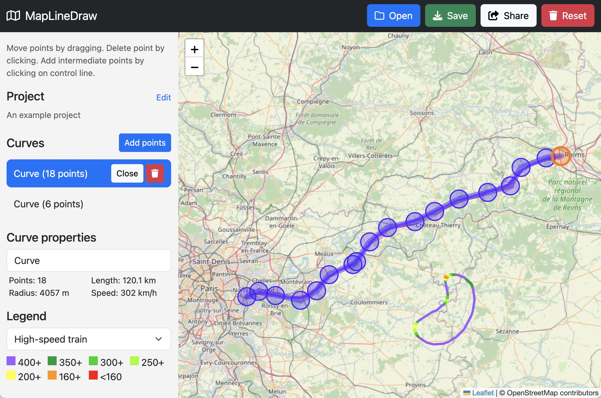

# Introducing MapLineDraw: Draw Smooth Curves on Real Maps — Free and Open Source

Have you ever tried to sketch a railway corridor or road alignment on a digital map, only to end up fighting with clunky polylines and jagged curves?

Whether you're a transit enthusiast, a city planner, or just someone who loves to visualize infrastructure, there's now a purpose-built tool designed exactly for you: **[MapLineDraw](https://maplinedraw.com)**.

## 🛠 What Is MapLineDraw?

**MapLineDraw** is a free, open source web application that lets you **draw smooth spline curves** directly on an interactive map (using OpenStreetMap tiles). The tool is ideal for:

* Sketching **railway lines**, **highways**, **race tracks**, or other paths
* Measuring real-world infrastructure curves
* Visualizing concepts for future public transport
* Sharing your ideas with others using simple, link-based projects

Unlike typical line-drawing tools that rely on connected straight segments, MapLineDraw uses **cubic B-splines**, which means it can represent curves with **continuous curvature** — an important factor in real-world rail or road design, and a big step up for visual accuracy.

## ✨ Key Features

* 🎯 **Interactive Spline Drawing**
  Click to place control points, drag them to adjust, and instantly see the resulting curve update in real time.

* 🧩 **Cubic B-splines (Degree 3)**
  Smooth, flowing paths with continuous curvature — no more jagged angles.

* 📏 **Automatic Geometry Analysis**
  The app calculates total curve length, minimum radius, and estimated **maximum speed** using typical comfort-based acceleration thresholds used in railway engineering.

* 🔄 **Open or Closed Curves**
  Great for both routes and loops — perfect for track modeling, circular paths, and more.

* 📝 **Project Metadata**
  Add a name, author, and description for your design ideas.

* 📂 **Download and Share**
  Save your projects to a custom `.json` file, which includes all curve geometry and metadata. Or, use shareable URLs to send your project directly to others.

* 🎨 **Customizable Legends**
  Color-coded curve categories, editable via text file, help clarify your visualizations.

## 🚋 Why It Matters

Infrastructure design is no longer the exclusive domain of specialized, expensive CAD tools. With **MapLineDraw**, anyone can:

* Draft hypothetical **rail corridors** across regions
* Analyze **existing road or rail curves** for speed feasibility
* Trace **real-world routes** for measurement or export
* Sketch **race track concepts**, nature trails, or even fantasy transit systems

It's a tool built with clarity and openness in mind — perfect for hobbyists, students, planners, or open data advocates.

## 📂 Export Format

While MapLineDraw does not currently export GeoJSON or KML, it allows you to download your project in a custom JSON format. This includes:

* Curve type (open or closed)
* Degree of spline
* Control point coordinates (lat/lon)
* Project metadata and legend

Because the format is clean and structured, it's easy to convert into other formats using a simple script — or fork the project to add that feature.

## 🔓 Open Source and Actively Maintained

MapLineDraw is fully open source under the [MIT license](https://github.com/patrsc/MapLineDraw). You can:

* View or contribute on GitHub: [https://github.com/patrsc/MapLineDraw](https://github.com/patrsc/MapLineDraw)
* Suggest features or report bugs via issues
* Fork the project and customize it to your needs

## 🚧 Known Limitations

MapLineDraw is **not a professional-grade design tool** — and that's okay. Its goal is simplicity, accessibility, and visual clarity, not engineering validation.

* No elevation (z-axis) support (so no tunnels/bridges yet)
* No mobile browser optimization (best used on desktop)
* No built-in export to GIS formats (yet)

Still, for a lightweight, highly usable curve-drawing app — it’s already ahead of most general-purpose map tools.

## 🌐 Try It Yourself

Just go to [**maplinedraw.com**](https://maplinedraw.com) and start drawing — no install or login needed.

MapLineDraw provides a simple, spline-aware drawing tool that feels fast, focused, and free. Whether you're mapping out the next high-speed rail link or tracing an existing corridor for fun, it's a tool that helps ideas take shape — smoothly.

If you like the tool or have suggestions how to improve it, feel free to contribute or open an issue on GitHub: [https://github.com/patrsc/MapLineDraw](https://github.com/patrsc/MapLineDraw).
